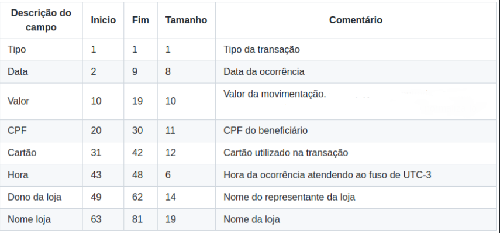
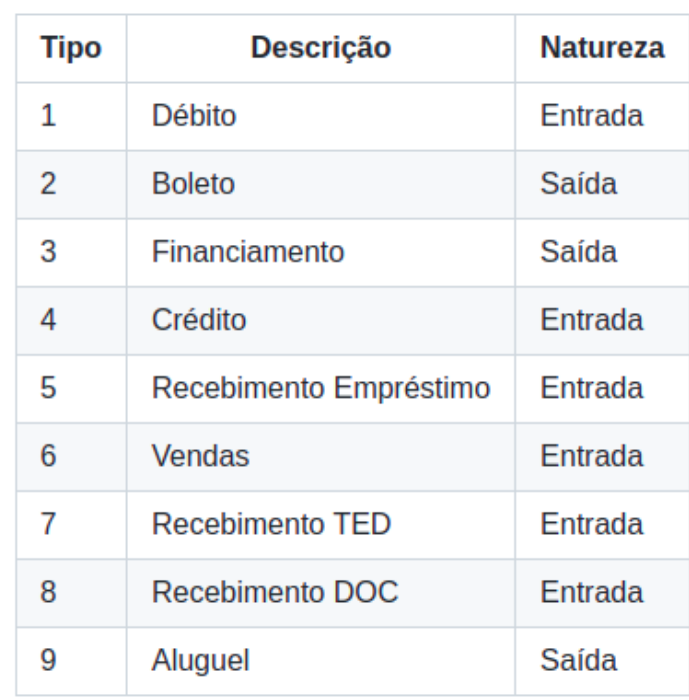
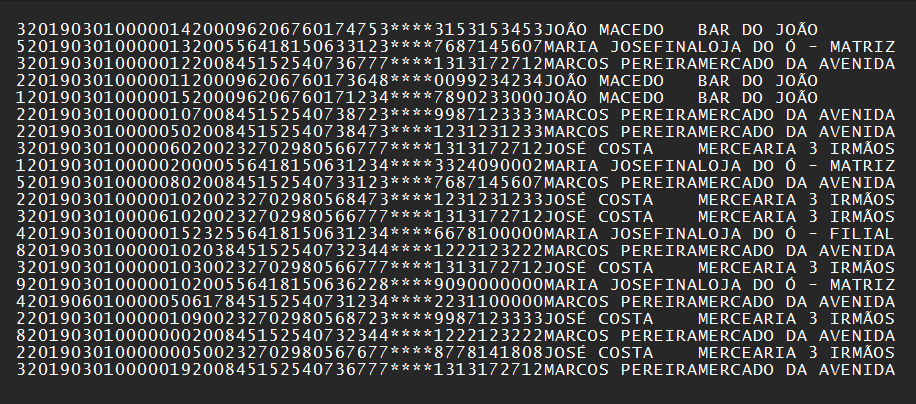

# Movimentações Financeiras - CNAB

---

## Documentação do projeto

- [Movimentações Financeiras - CNAB](#movimentações-financeiras---cnab)
  - [Documentação do projeto](#documentação-do-projeto)
  - [1. Descrição do projeto](#1-descrição-do-projeto)
    - [1.1 Documentação CNAB](#11-documentação-cnab)
    - [1.2 Documentação sobre os tipos de transações](#12-documentação-sobre-os-tipos-de-transações)
    - [1.3 Exemplo de arquivo CNAB](#13-exemplo-de-arquivo-cnab)
    - [1.4 Dowload de arquivo CNAB para testes](#14-dowload-de-arquivo-cnab-para-testes)
  - [2. Tecnologias utilizadas](#2-tecnologias-utilizadas)
  - [3. Passos de instalação e execução em ambiente de desenvolvimento](#3-passos-de-instalação-e-execução-em-ambiente-de-desenvolvimento)
    - [3.1 Iniciando projeto e ambiente virtual](#31-iniciando-projeto-e-ambiente-virtual)
    - [3.2 Ative a máquina virtual:](#32-ative-a-máquina-virtual)
    - [3.3 Instale as dependências do projeto](#33-instale-as-dependências-do-projeto)
    - [3.4 Crie um arquivo .env na raiz do projeto](#34-crie-um-arquivo-env-na-raiz-do-projeto)
    - [3.5 Rode as migrações](#35-rode-as-migrações)
    - [3.6 Inicie o servidor localmente](#36-inicie-o-servidor-localmente)

---

## 1. Descrição do projeto
A aplicação tem uma interface web que aceita upload de arquivos CNAB em formato .txt (com os dados das movimentações financeiras de várias lojas), que normaliza os dados e os armazena em um banco de dados exibindo essas informações em tela.
 
### 1.1 Documentação CNAB


### 1.2 Documentação sobre os tipos de transações


### 1.3 Exemplo de arquivo CNAB


### 1.4 Dowload de arquivo CNAB para testes 
Se preferir, você pode fazer o dowload de um arquivo CNAB para testes [clicando aqui](https://drive.google.com/file/d/1w5n2TCAcq21S5JVmzzslb1G36pqt2d7y/view?usp=sharing)

---

## 2. Tecnologias utilizadas
- [Django](https://docs.djangoproject.com/en/4.1/)
- [Django REST Framework](https://www.django-rest-framework.org/)
- [python-dotenv](https://pypi.org/project/python-dotenv/)

---

## 3. Passos de instalação e execução em ambiente de desenvolvimento
### 3.1 Iniciando projeto e ambiente virtual
Clone o projeto em sua máquina e inicie um ambiente virtual com o comando:

```
python -m venv venv
```
### 3.2 Ative a máquina virtual:
```
venv/scripts/activate
```
### 3.3 Instale as dependências do projeto 
```
pip install -r requirements.txt
```
### 3.4 Crie um arquivo .env na raiz do projeto
Copie o formato do arquivo .env.example para o arquivo .env e preencha as variáveis, exemplo:
```
SECRET_KEY="sua_chave_secreta"
```

### 3.5 Rode as migrações 
```
python manage.py migrate
```
### 3.6 Inicie o servidor localmente 
```
python manage.py runserver
```
---
